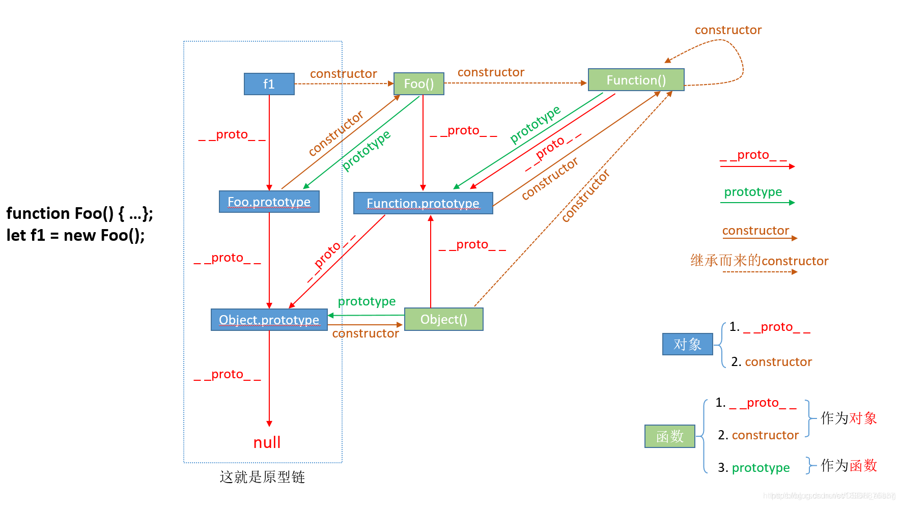

# 原型继承

js 不是面向对象编程的语言,没有真正类的概念,es6 中的类是一种语法糖,本质还是函数。通过 prototype 来模拟类行为。在传统面向类语言中，父类、子类、实例之间是一个复制关系，而 prototype 只是关联引用的关系。

## 继承

需要继承的原因,将创建不同对象或者同一类对象的属性和方法抽取出来形成公共模块,减少冗余代码.

有哪些可以继承的

- 实例的属性和方法
- 静态属性和方法
- 原型属性和方法

哪些应该继承

- 实例的属性（复制实例上面的属性）
- 原型的方法（引用原型上的方法）
- 静态属性和方法（构造函数上面的属性和方法）

继承的原则

## 必备知识点

### new 操作符

- 以构造器的 prototype 属性为原型，创造一个新的、空的对象
- 将它的引用赋给构造器的 this，同时将参数传到构造器中执行
- 如果构造器没有手动返回对象，则返回第一步创建的新对象，如果有，则舍弃掉第一步创建的新对象，返回手动 return 的对象。

手动实现一个 new 方法

```js
class Lijianhua {
  constructor() {
    this.lastname = 'li';
    this.firstname = 'jianhua';
  }
  say() {
    console.log('hi');
  }
}

// 自己定义的new方法
const newMethod = function (Parent, ...rest) {
  // 1.以构造器的prototype属性为原型，创建新对象；
  const child = Object.create(Parent.prototype);
  // 2.将this和调用参数传给构造器执行
  const result = Parent.apply(child, rest);
  // 3.如果构造器没有手动返回对象，则返回第一步的对象
  return typeof result === 'object' ? result : child;
};
// 创建实例，将构造函数Parent与形参作为参数传入
const her = newMethod(Lijianhua);
her.say(); // 'hi';
console.log(her instanceof Lijianhua); // true
```

## 原型链

- 实例对象是没有 constructor 属性，是通过继承原型链上的
- 函数是对象的一种，是 Function()的实例
- prototype 是函数中的一个属性，它指向通过这个函数生成对象的一个共有祖先,是可以被改变的，他和 constructor 是成对相反的。



## js 继承

在其他面向类语言中，继承意味着复制操作，子类是实实在在地将父类的属性和方法复制了过来，但 javascript 中的继承不是这样的。

根据原型的特性，js 中继承的本质是一种委托机制，对象可以将需要的属性和方法委托给原型，需要用的时候就去原型上拿，这样多个对象就可以共享一个原型上的属性和方法，这个过程中是没有复制操作的。

javascript 中的继承主要还是依靠于原型链，原型处于原型链中时即可以是某个对象的原型也可以是另一个原型的实例，这样就能形成原型之间的继承关系。

然而，依托原型链的继承方式是有很多弊病的，我们需要辅以各种操作来消除这些缺点，在这个探索的过程中，出现了很多通过改造原型链继承而实现的继承方式。

### 原型链继承

原型链继承的核心就一句话：用父类实例作为子类原型，这使得子类实例最终可以访问父类上的属性和其原型上的方法。

```js
function Parent() {
  this.name = 'xiaoming';
}
Parent.prototype.getNames = function () {
  console.log(this.names);
};
function Child() {
  this.ages = 18;
}
Child.prototype = new Parent();
const child = new Child();
console.log(child.__proto__.__proto__ === Parent.prototype); // true
```

- 子类实例化的时候不能向父类构造函数传参，只能在设置子类原型为父类实例给父类构造函数传参。
- 虽然继承了父类的实例的属性，但这些个属性是作为子类实例的原型上的属性的，没有做到隔离开来。

### 构造函数继承

借用父类构造函数，它的核心就是完全不使用原型，而是在子类构造函数中通过 call 调用父类构造函数，从而增强子类实例。

```js
function Parent(name, sex) {
  this.name = name;
  this.sex = sex;
}
Parent.prototype.getNames = function () {
  console.log(this.names);
};
function Child(name, sex, ages) {
  Parent.call(this, name, sex);
  this.ages = ages;
}
const child = new Child('xiaohong', '男', 18);
console.log(child.getNames); // undefined
```

- 可以往父类传参
- 子类的所有实例都会继承父类实例的方法和属性
- 父类原型上的方法，子类是无法继承

### 组合继承

组合继承的原理就是先通过盗用构造函数实现上下文绑定和传参，然后再使用原型链继承的手段将子构造函数的 prototype 指向父构造函数的实例，代码如下：

```js
function Parent(name, sex) {
  this.name = name;
  this.sex = sex;
}
Parent.prototype.getNames = function () {
  console.log(this.names);
};
function Child(name, sex, ages) {
  Parent.call(this, name, sex);
  this.ages = ages;
}
Child.prototype = new Perent();
const child = new Child('xiaohong', '男', 18);
console.log(child.getNames); // xiaohong
```

- 在实现的过程中调用了两次 Person 构造函数，有一定程度上的冗余，生成了多余的属性

### 原型式继承

2006 年，道格拉斯.克罗克福德写了一篇文章《Javascript 中的原型式继承》。这片文章介绍了一种不涉及严格意义上构造函数的继承方法。他的出发点是即使不自定义类型也可以通过原型实现对象之间的信息共享。

```js
const object = function (o) {
  function F() {}
  F.prototype = o;
  return new F();
};
```

其实不难看出，这个函数将原型链继承的核心代码封装成了一个函数，但这个函数有了不同的适用场景：如果你有一个已知的对象，想在它的基础上再创建一个新对象，那么你只需要把已知对象传给 object 函数即可。

ES5 新增了一个方法 Object.create()将原型式继承规范化了。相比于上述的 object()方法，Object.create()可以接受两个参数，第一个参数是作为新对象原型的对象，第二个参数也是个对象，里面放入需要给新对象增加的属性（可选）。

第二个参数与 Object.defineProperties()方法的第二个参数是一样的，每个新增的属性都通过自己的属性描述符来描述，以这种方式添加的属性会遮蔽原型上的同名属性。当 Object.create()只传入第一个参数时，功效与上述的 object()方法是相同的。

- 不能传参，使用手写的 object()不能传，但使用 Object.create()是可以传参的。
- 原对象中的引用类型的属性会被新对象共享。

### 寄生式继承

寄生式继承与原型式继承很接近，它的思想就是在原型式继承的基础上以某种方式增强对象，然后返回这个对象。

```js
function inherit(o) {
  let clone = Object.create(o);
  clone.sayHi = function () {
    // 增强对象
    console.log('Hi');
  };
  return clone;
}
```

### 寄生式组合继承

寄生式组合继承通过盗用构造函数继承属性，但使用混合式原型链继承方法。基本思路就是使用寄生式继承来继承父类的原型对象，然后将返回的新对象赋值给子类的原型对象。

首先实现寄生式继承的核心逻辑

```js
function inherit(Son, Father) {
  const prototype = Object.create(Father.prototype); // 获取父类原型对象副本
  prototype.constructor = Son; // 将获取的副本的constructor指向子类，以此增强副本原型对象
  Son.prototype = prototype; // 将子类的原型对象指向副本原型对象
}
```

这里没有将新建的对象返回出来，而是赋值给了子类的原型对象。

接下来就是改造组合式继承，将第二次调用构造函数的逻辑替换为寄生式继承：

```js
function Person(eyes) {
  this.eyes = eyes;
  this.colors = ['white', 'yellow', 'black'];
}
Person.prototype.getEyes = function () {
  return this.eyes;
};
function YellowRace() {
  Person.call(this, 'black'); // 调用构造函数并传参
}
inherit(YellowRace, Person); // 寄生式继承，不用第二次调用构造函数
const hjy = new YellowRace();
hjy.colors.push('green');
const laowang = new YellowRace();
console.log(hjy.colors); // ['white', 'yellow', 'black', 'green']
console.log(laowang.colors); // ['white', 'yellow', 'black']
console.log(hjy.getEyes()); // black
```

上述寄生式组合继承只调用了一次 Person 造函数，避免了在 Person.prototype 上面创建不必要、多余的属性。于此同时，原型链依然保持不变，效率非常之高效。

### class 继承
