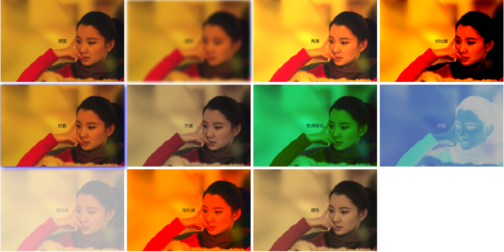
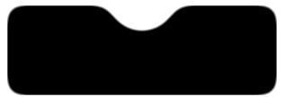

# filter

## 值

- filter: blur(5px); 模糊
- filter: brightness(1.4); 亮度
- filter: contrast(200%); 对比度
- filter: drop-shadow(4px 4px 8px blue); 投影
- filter: grayscale(50%); 灰度
- filter: hue-rotate(90deg); 色调变化
- filter: invert(75%); 反相
- filter: opacity(35%); 透明度
- filter: saturate(230%); 饱和度
- filter: sepia(60%); 褐色

效果：



## filter:blur() 和 backdrop-filter:blur()的区别

filter: blur() 会对当前元素和子元素都有影响  
backdrop-filter: blur() 则会对父元素有影响

## blur 和 contrast 搭配

blur 和 contrast 搭配能实现融合的效果， 增强对比度会去掉子元素的模糊效果

blur: 默认 0px；
contrast：默认 1（100%）

例子

```html
<div class="g-container">
  <div class="g-content">
    <div class="g-filter"></div>
  </div>
</div>
```

```css
.g-container {
  position: relative;
  width: 300px;
  height: 100px;
}

.g-content {
  height: 100px;
  filter: contrast(10);
  background-color: #fff;
  overflow: hidden;
}

.g-filter {
  height: 100px;
  background: radial-gradient(
    circle at 50% -10px,
    transparent 0,
    transparent 39px,
    #000 40px,
    #000
  );
  filter: blur(10px);
}
```

效果：



## filter: drop-shadow()

和 box-shadow 的区别：

filter: drop-shadow()是对整个形状的投影，包括不规则多个元素的组合形状。box-shadow 属性则需要每个元素单独设置

例子：

```html
<div class="circle"></div>
```

```css
.circle {
  position: relative;
  width: 200px;
  height: 100px;
  border-radius: 50%;
  background-color: gray;
  filter: drop-shadow(4px 4px 10px #f40);
  /* box-shadow: 4px 4px 10px #f40; */
  z-index: 1;
}

.circle::after {
  z-index: -2;
  display: block;
  content: "";
  position: absolute;
  bottom: 10px;
  left: 20px;
  width: 70px;
  height: 30px;
  background-color: gray;
  transform: skewX(-40deg);
}
```

## grayscale()

将图像转换为灰度图像。值定义转换的比例。值为 100%则完全转为灰度图像，值为 0%图像无变化。值在 0%到 100%之间，则是效果的线性乘子。若未设置，值默认是 0；

应用 1：将某个图标变为完全灰色。
