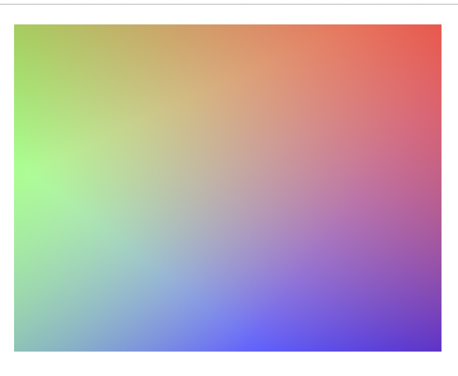

# 色彩

## 渐变

背景色的渐变

渐变类型

简单渐变：
线性渐变：linear-gradient
径向渐变：radial-gradient
圆锥渐变：conic-gradient

重复渐变
重复线性渐变：repeating-linear-gradient
重复径向渐变：repeating-radial-gradient

## 作用

能实现的效果：能实现明显的分界线
可以有透明度

## 语法

线性渐变

```css
linear-gradient(directin, color1, color2, ...)
/**
position: to bottom(top, right, left), turn, deg
*/
```

径向渐变

```css

radial-gradient(shape size at position, color1, color2, ...)
/**
shape: ellipse(默认), circle
size：farthest(closest)-corner(side)
position: center, top, bottom, ...
*/
```

## 例子


```css
background: linear-gradient(0.25turn, #3f87a6, #ebf8e1, #f69d3c);
```
```css
background: linear-gradient(to left, #333, #333 50%, #eee 75%, #333 75%);
```
```css
background: linear-gradient(217deg, rgba(255,0,0,.8), rgba(255,0,0,0) 70.71%),
            linear-gradient(127deg, rgba(0,255,0,.8), rgba(0,255,0,0) 70.71%),
            linear-gradient(336deg, rgba(0,0,255,.8), rgba(0,0,255,0) 70.71%);
```

## 题目

1.实现该渐变

